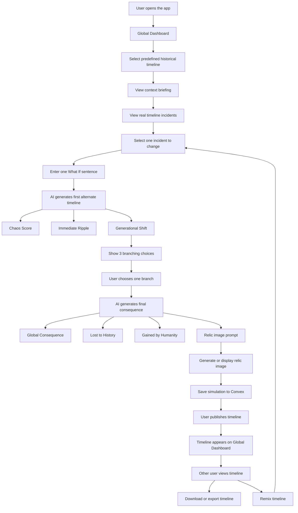

# AltEra
## Simulate the Unseen.

**AltEra** is an AI-powered alternate history simulator where users change one specific historical incident and watch a new timeline unfold. The app is built around the butterfly effect: one small change in the past can reshape politics, technology, borders, culture, and the modern world.

Users begin with a predefined historical timeline such as **World War I** or **World War II**, select one real incident, enter a single-sentence "What if?" change, and receive an AI-generated alternate timeline with ripple effects, branching decisions, global consequences, and visual relics from the new reality.

## Core Idea

Instead of asking users to start from a blank page, TimeLens provides curated historical timelines with real incidents, short context briefings, related images, and actual outcomes.

Example:

```txt
Timeline: World War I
Incident: Assassination of Archduke Franz Ferdinand, 1914
What if: The assassin hesitates and the motorcade escapes Sarajevo.
```

The AI then generates a structured alternate timeline:

- **Chaos Score**: how disruptive the change is.
- **Immediate Ripple**: consequences within 1 to 5 years.
- **Generational Shift**: consequences within 20 to 50 years.
- **Branching Choices**: three possible social or political reactions.
- **Global Consequence**: the 100+ year outcome after the user chooses a branch.
- **Lost to History**: things that disappear from the original timeline.
- **Gained by Humanity**: new inventions, nations, ideologies, or events created by the divergence.
- **Relic Image Prompt**: a prompt for generating an alternate-history artifact or visual.

## Main Features

### 1. Historical Timeline Selection

Users select one predefined historical timeline, such as:

- World War I Timeline
- World War II Timeline
- Roman Empire Timeline
- Industrial Revolution Timeline
- Cold War Timeline

Each timeline contains real historical incidents with:

- Title
- Year or date
- Location
- Short description
- Related image
- Real historical outcome
- Context briefing

### 2. Context Briefing

Before changing history, the app explains the real event and its stakes. This helps the user understand why the incident mattered and what consequences followed in real history.

### 3. "What If?" Input

The user enters one short sentence describing the change.

Example:

```txt
The courier carrying the battle orders gets lost in the fog.
```

The input should be limited to one sentence to keep the AI focused and prevent overly complex prompts.

### 4. AI Timeline Generation

The AI returns strict structured JSON so the frontend can render the result as a polished timeline.

The first generation includes:

- Chaos Score
- Immediate Ripple
- Generational Shift
- Three branching choices

### 5. Branching Decision

After the generational shift, the app pauses and lets the user choose one of three possible directions. This turns the experience from a simple generator into an interactive simulation.

### 6. Final Consequence Generation

After the branch is selected, the AI generates:

- Global Consequence
- Lost to History
- Gained by Humanity
- Relic image prompt

### 7. Relic Image Generation

The app generates or displays an alternate-history relic image based on the AI prompt.

Examples:

- A museum photograph of a fictional treaty medal
- A military uniform from an empire that never existed
- A newspaper front page from an alternate 1940s
- A schematic of alternate military technology
- A portrait of a leader from the divergent timeline

### 8. Global Multiverse Dashboard

Published simulations appear on a live global dashboard. Other users can view public timelines and explore alternate realities created by the community.

### 9. Publish, Download, Export, and Remix

Users can publish their generated timelines. Other users can:

- View public timelines
- Download or export timelines
- Remix a timeline
- Change a different incident
- Create a new branch from someone else's simulation

## App Flow



## Suggested Tech Stack

| Layer | Technology |
|---|---|
| Frontend | Next.js + TypeScript |
| Styling | Tailwind CSS |
| Animations | Framer Motion |
| Realtime database | Convex |
| AI text generation | OpenAI, Gemini, Claude, or Mistral |
| Structured AI output | JSON schema / structured outputs |
| Image generation | OpenAI image generation or another image model |
| Deployment | Vercel |

## Recommended AI Architecture

TimeLens should not rely only on an LLM's memory. A better design is:

```txt
User selects timeline incident
        ↓
Retrieve real historical context from database
        ↓
Send context + user What If prompt to LLM
        ↓
LLM returns strict JSON
        ↓
Frontend renders timeline, chaos score, branches, and ledger
        ↓
User chooses a branch
        ↓
LLM generates global consequence and relic prompt
        ↓
Image model generates or displays relic image
```

This keeps the output more grounded and reduces historical hallucinations.

## Core Data Structure

### PredefinedTimeline

```ts
type PredefinedTimeline = {
  _id: string;
  title: string;
  slug: string;
  summary: string;
  coverImageUrl: string;
  startYear: number;
  endYear: number;
  createdAt: number;
};
```

### TimelineIncident

```ts
type TimelineIncident = {
  _id: string;
  timelineId: string;
  year: string;
  title: string;
  description: string;
  location?: string;
  relatedImageUrl?: string;
  realOutcome: string;
  order: number;
};
```

### Simulation

```ts
type Simulation = {
  _id: string;
  userId: string;
  originalTimelineId: string;
  changedIncidentId: string;
  whatIfPrompt: string;

  chaosScore: number;

  immediateRipple: TimelineEvent[];
  generationalShift: TimelineEvent[];
  branchChoices: BranchChoice[];

  selectedBranchId?: string;
  globalConsequence?: TimelineEvent[];

  lostToHistory?: string[];
  gainedByHumanity?: string[];

  relicPrompt?: string;
  relicImageUrl?: string;

  status: "draft" | "generated" | "published";
  visibility: "private" | "public";

  parentSimulationId?: string;
  remixOfSimulationId?: string;

  createdAt: number;
  updatedAt: number;
};
```

### TimelineEvent

```ts
type TimelineEvent = {
  year: string;
  title: string;
  description: string;
  impactLevel: "low" | "medium" | "high";
};
```

### BranchChoice

```ts
type BranchChoice = {
  id: string;
  title: string;
  description: string;
};
```

### PublishedTimeline

```ts
type PublishedTimeline = {
  _id: string;
  simulationId: string;
  authorId: string;

  title: string;
  description: string;
  thumbnailUrl?: string;

  downloads: number;
  remixes: number;
  likes: number;

  createdAt: number;
};
```

### Remix

```ts
type Remix = {
  _id: string;
  originalSimulationId: string;
  remixedSimulationId: string;
  originalAuthorId: string;
  remixAuthorId: string;

  changedIncidentId: string;
  newWhatIfPrompt: string;

  createdAt: number;
};
```

### ExportFile

```ts
type ExportFile = {
  _id: string;
  simulationId: string;
  userId: string;

  format: "pdf" | "json" | "image";
  fileUrl: string;

  createdAt: number;
};
```

## AI JSON Output Example

```json
{
  "chaosScore": 87,
  "immediateRipple": [
    {
      "year": "1915",
      "title": "A Diplomatic Crisis Without War",
      "description": "The failed assassination attempt creates outrage, but European leaders delay military escalation.",
      "impactLevel": "high"
    }
  ],
  "generationalShift": [
    {
      "year": "1940",
      "title": "Empires Decay Slowly",
      "description": "Without the shock of World War I, old European empires survive longer but face deeper internal unrest.",
      "impactLevel": "high"
    }
  ],
  "branchChoices": [
    {
      "id": "branch_1",
      "title": "Europe chooses diplomacy",
      "description": "Major powers form a tense diplomatic council to avoid continent-wide war."
    },
    {
      "id": "branch_2",
      "title": "Militarism intensifies",
      "description": "Nations avoid war temporarily but expand armies and weapons programs."
    },
    {
      "id": "branch_3",
      "title": "Nationalist revolts spread",
      "description": "Ethnic and nationalist movements challenge the old imperial order from within."
    }
  ],
  "lostToHistory": [
    "The original Treaty of Versailles",
    "The League of Nations in its known form"
  ],
  "gainedByHumanity": [
    "A permanent European crisis council",
    "Delayed mechanized warfare doctrine"
  ],
  "relicPrompt": "A museum photograph of a 1930s European diplomatic council medal from an alternate timeline where World War I never began, brass and enamel, archival lighting, realistic historical artifact."
}
```

## MVP Development Plan

### Tier 1: Core MVP

- Predefined timeline selection
- Incident selection
- Context briefing
- One-sentence What If input
- AI-generated timeline JSON
- Timeline viewer

### Tier 2: Engagement Layer

- Chaos Score meter
- Lost to History vs Gained by Humanity ledger
- Branching decision choices
- Save simulation to Convex

### Tier 3: Wow Features

- Relic image generation
- Global realtime dashboard
- Publish and remix timelines
- Demo mode with a pre-seeded golden path
- Cinematic Framer Motion timeline animations

## Demo Safety Net

Live AI calls can fail, lag, or become expensive during presentations. TimeLens should include a **Demo Mode** with one pre-saved polished simulation.

Example demo:

```txt
Timeline: World War I
Incident: Assassination of Archduke Franz Ferdinand
What if: The assassin hesitates and the motorcade escapes Sarajevo.
```

This lets the team demonstrate the full UI, animations, chaos score, branching, ledger, and relic image even if the network or AI API fails.

## Future Enhancements

- AI video generation for cinematic timeline moments
- Interactive alternate world map
- Location-based historical mode using phone camera input
- Classroom mode for teachers and students
- Public voting on best alternate timelines
- Timeline PDF export with generated images
- Multilingual historical simulations

## Project Vision

TimeLens turns history into an interactive simulation. It helps users understand that history is not just a list of events, but a chain of causes and consequences. By combining real historical context, AI-generated alternate timelines, branching decisions, and visual relics, the app makes the question **"What if?"** feel alive.

