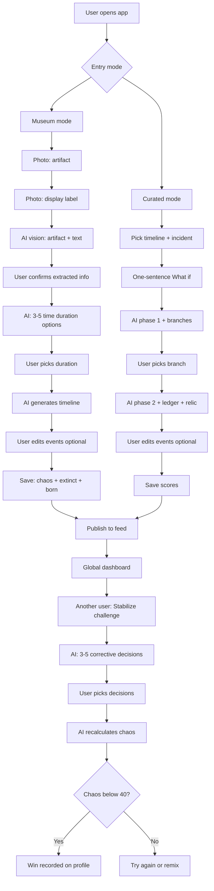

# AltEra — 24-hour hackathon plan v2 (4 people)

## Senior engineer assessment (your new direction)

**Verdict: Strong product idea, very high execution risk in 24 hours — still doable if you treat it as one shared engine with two entry doors and one game layer.**

### What works well

- **Museum hook** is memorable for judges (“point your phone at history”) and differentiates you from generic chat apps.
- **Dual entry** (museum scan vs curated timeline) is the right call: museum is the wow; curated is the reliability fallback when lighting or OCR fails.
- **Extinct vs born + chaos score** maps cleanly to your existing `lostToHistory` / `gainedByHumanity` / `chaosScore` — rename in UI, same data.
- **Chaos creators vs fixers** is a clear game loop with a demo-friendly win condition: **pick corrective branches until chaos drops below threshold** (you chose this — good MVP).
- **Editable timeline** before save increases agency and makes the “fix it” game feel fair.

### What is hard (be explicit with the team)

| Risk | Why |
|---|---|
| **Both paths equal for judges** | You doubled surface area: camera/upload, vision OCR, duration picker, *plus* full curated flow *plus* stabilize game. |
| **Vision accuracy** | Display labels are glare/blur; AI may misread dates. Always show extracted text for user to confirm before generating. |
| **“Fix to real history”** | Full restoration is ambiguous; your **branch + chaos threshold** approach is the right 24h cut. |
| **Editable timeline UI** | Full drag-and-drop editor is out; MVP = edit title/description per event inline only. |

### Recommendation (non-negotiable for judges)

1. **One shared `Simulation` model** — `source: "museum" | "curated"` — same timeline viewer, ledger, chaos, publish, game.
2. **Demo mode for all three beats**: museum analyze, curated generate, stabilize win — pre-seeded JSON if live fails.
3. **Hidden priority if behind at hour 16**: ship curated + game first; museum live with **one pre-tested artifact pair** in `public/demo-museum/`.

---

## Confirmed inputs (from you)

| Decision | Your choice |
|---|---|
| Event | **Hackathon — live demo to judges** |
| Must ship (original) | Live AI, branching, relic image, publish + feed, remix, Convex Auth |
| Must ship (new) | **Museum dual-photo flow**, **time duration options**, **editable timeline**, **extinct/born + chaos (saved)**, **stabilize game** (corrective branches, win if chaos below threshold) |
| Entry for demo | **Both museum and curated equally** (high risk — mitigations above) |
| Game win rule | User picks from **3–5 AI corrective decisions**; **win if resulting chaos score < 40** (threshold configurable) |
| Skip without museum | **Curated timeline selection** remains — required fallback |
| Repo state | Empty greenfield |
| Team | 4 people, 24 hours |

## Assumptions (confirm with team at Hour 0)

These were **not** answered yet; the plan below uses them. Change at kickoff if wrong.

| Topic | Assumption |
|---|---|
| Team split | **2 full-stack**, **1 frontend-leaning**, **1 backend/AI-leaning** |
| Hard demo time | **Hour 20** — hours 21–24 are buffer, rehearse, hotfix only |
| AI provider | **OpenAI** — `gpt-4o-mini` (text, structured JSON) + `gpt-image-1` or `dall-e-3` (relic) |
| Auth method | **Convex Auth** with fastest provider to wire (GitHub OAuth or magic link — pick one at Hour 0, no both) |
| Timelines in seed | **3 timelines** (Anuradhapura, Polonnaruwa, Mahanuwara), **7 incidents** across kingdoms (quality > quantity) |
| Demo mode | **Build anyway** — judges + live AI = high failure risk; 30 min at hour 22 if behind |

---

## Product flows (v2)



### Ledger naming (UI vs data)

| UI label | Data field |
|---|---|
| What goes **extinct** | `lostToHistory: string[]` |
| What was **born** | `gainedByHumanity: string[]` |
| **Chaos score** | `chaosScore: number` (0–100) |

---

## What “done” means for the judge demo (Definition of Done)

**Path A — Museum (live or demo fallback)**

1. Sign in.
2. Choose **Scan museum artifact**.
3. Upload/capture **artifact photo** + **label photo** (or use bundled demo images).
4. AI shows extracted artifact name + label text → user confirms.
5. AI shows **3–5 time duration options** → user picks one (e.g. “50 years forward”).
6. AI generates timeline → user **edits at least one event** inline → Save.
7. UI shows **chaos score**, **extinct**, **born**.

**Path B — Curated (live)**

8. Choose **Browse historical timelines** → **Kandyan Kingdom (Mahanuwara)** → **The Kandyan Convention (1815)** → What if → branches → phase 2 → relic image → Save (same ledger + chaos).

**Path C — Game**

9. Dashboard → open a **high-chaos** published timeline (seed one with chaos 85+).
10. Tap **Stabilize** → AI shows **3–5 corrective decisions** → user picks 1+ → chaos recalculated.
11. If chaos **< 40** → **WIN** banner + record on user profile.

**Social (unchanged)**

12. Publish own timeline → appears on feed. **Remix** still available.

**Failure criteria:** any of the three paths hangs without error UI; stabilize never updates chaos; museum upload fails silently.

---

## Scope: IN vs OUT for 24 hours

### IN (committed — v2)

- Everything from v1 **plus**:
- **Museum scan**: 2 images → Convex storage → vision action → confirm screen
- **Time duration options** (3–5) → timeline generation action
- **Inline timeline editor** (edit `title` + `description` per event only)
- **Saved scores**: chaos + extinct + born persisted on `simulations`
- **Stabilize game**: corrective branches → recalculate chaos → win if `< 40`
- **User stats**: `wins`, `chaosCreated`, `timelinesStabilized` on `users` or `playerStats`
- **Dual home CTAs**: “Scan artifact” | “Browse timelines”
- Demo mode for **museum**, **curated**, and **stabilize** paths

### OUT (explicit cuts — do not start)

- PDF export; 5+ timelines; AI video; world map; AR camera beyond file input
- Full drag-and-drop timeline editor; event add/remove (edit text only)
- Real-time multiplayer; chat; leaderboards beyond simple win count
- Proving historical “100% accuracy” on fix — use chaos threshold only
- OCR manual correction UI beyond one “edit extracted text” textarea

---

## Team roles (4 people)

Assign **one name per role** at Hour 0. Each person owns merges in their lane; integrate via `main` every 2 hours.

| Role | Person | Owns | Does NOT own |
|---|---|---|---|
| **Lead / Integrator** | Person A | Schema, shared `Simulation` type, deploy, museum upload API, hour 19 freeze | All UI |
| **Backend / AI** | Person B | Vision analyze, duration options, curated phase1/2, stabilize rescore, JSON schemas | Camera UI |
| **Frontend / Flow** | Person C | Home dual CTA, museum wizard, curated wizard, **timeline editor**, chaos/ledger UI | AI prompts |
| **Game / Content** | Person D | Seed data, dashboard badges (Chaos/Fix), stabilize UI, demo images, judge script | Vision API |

**Pairing rules**

- B + C: AI contract + loading/error UX (hours 5–10)
- A + D: publish/remix mutations + dashboard (hours 15–18)
- Everyone: hour 19 smoke test on production URL

---

## 24-hour schedule (hour-by-hour)

```mermaid
gantt
  title AltEra 24h Schedule
  dateFormat HH:mm
  axisFormat %H:%M

  section Foundation
  Kickoff and accounts     :h0, 00:00, 1h
  Scaffold and schema      :h1, 01:00, 3h

  section Core
  Phase1 AI and simulate UI :h4, 04:00, 6h
  Phase2 branch and ledger  :h10, 10:00, 4h

  section Social
  Images and auth save      :h14, 14:00, 4h
  Publish feed remix        :h18, 18:00, 2h

  section Ship
  Freeze and deploy         :h20, 20:00, 1h
  Rehearse and buffer       :h21, 21:00, 3h
```



### Hour 0 — Kickoff (60 min, all 4)

**Agenda (timed)**

| Min | Activity | Output |
|---|---|---|
| 0–10 | Confirm assumptions table above | Written in README or Notion |
| 10–20 | Create accounts: GitHub, Vercel, Convex, OpenAI | All 4 have access |
| 20–30 | Assign roles A/B/C/D; create Slack/Discord; branch strategy `main` + short PRs | Role doc |
| 30–45 | Agree AI JSON schemas (copy section below into repo) | `convex/ai/schemas.ts` stub |
| 45–55 | Agree golden demo path (**1815 Kandyan Convention** — convention never signed) | One paragraph in `DEMO.md` |
| 55–60 | Person A starts `create-next-app`; others pull seed content outline | Commands running |

**Pre-flight checklist (every item must be checked)**

- [ ] Convex team created; Person A is admin
- [ ] OpenAI API key with billing; **spend cap** set ($20–40)
- [ ] Vercel team linked to repo
- [ ] `.env.local` template agreed (no keys in git)
- [ ] Judge demo URL will be production (not localhost)
- [ ] One machine designated **demo machine** (logged in, cache warm)

---

### Hours 1–4 — Foundation (parallel)

**Person A — Integrator**

- `npx create-next-app@latest` — TS, Tailwind, App Router, `src/` optional
- `npm install convex @convex-dev/auth` (or current Convex Auth package per docs)
- `npx convex dev` — link deployment
- `convex/schema.ts` — all tables (see Data model section)
- `ConvexClientProvider` in `app/layout.tsx`
- Empty routes: `/`, `/timelines`, `/timelines/[slug]`, `/simulate/[incidentId]`, `/simulation/[id]`, `/dashboard`
- Push to GitHub; connect Vercel preview

**Person B — Backend**

- `convex/lib/auth.ts` — `getCurrentUser`, `requireAuth`
- `convex/users.ts` — upsert on first login
- Stub actions: `generatePhaseOne`, `generatePhaseTwo`, `generateRelicImage` (return mock until hour 5)
- `convex/ai/schemas.ts` — Zod or raw JSON schema objects for OpenAI structured outputs
- `convex/ai/prompts.ts` — system + user prompt builders (grounded on incident fields)

**Person C — Frontend**

- Tailwind theme: dark historical aesthetic (define 5 colors + 2 fonts in `globals.css`)
- Layout: header with logo **AltEra**, sign-in button placeholder
- Shared components skeleton: `ChaosMeter`, `TimelineEventCard`, `BranchChoiceCard`, `LedgerColumn`, `LoadingTimeline`

**Person D — Content**

- Write `convex/seed/timelines.json` — Anuradhapura, Polonnaruwa, Mahanuwara metadata
- Write `convex/seed/incidents.json` — 4–6 per timeline (real dates, outcomes, 2–3 sentence descriptions)
- Collect 6–12 images → `public/seed/` (Wikimedia Commons URLs documented in JSON)
- Draft `convex/seed/demoSimulation.json` — full phase-1 + phase-2 JSON from product spec
- Draft `DEMO.md` — judge script (90 seconds)

**Hour 4 integration checkpoint (15 min, all)**

- [ ] `npx convex dev` runs; schema deployed
- [ ] Seed mutation runs: timelines + incidents visible via Convex dashboard
- [ ] Next app loads home page
- [ ] Auth provider chosen and package installed (not necessarily working yet)

---

### Hours 5–10 — Core simulate flow (critical path)

**Person B**

1. `generatePhaseOne` action:
   - Load incident + timeline from DB
   - Call OpenAI with structured output schema
   - Validate response; `internal` mutation `patchSimulationPhase1`
2. `generatePhaseTwo` action:
   - Input: simulation id + `selectedBranchId`
   - Return: `globalConsequence`, `lostToHistory`, `gainedByHumanity`, `relicPrompt`
3. Rate limit: max 1 in-flight generation per user (mutation flag or status `generating`)

**Person C**

1. `/timelines` — grid of timelines from `api.timelines.list`
2. `/timelines/[slug]` — incidents list + **context briefing** panel (description + real outcome)
3. `/simulate/[incidentId]`:
   - What If textarea: max 200 chars, single-sentence validation (no second `.` or `?` after first)
   - Submit → create draft simulation → call phase 1 → navigate to `/simulation/[id]`
4. `/simulation/[id]` — phase 1 results + branch cards (disabled until loaded)
5. Branch select → call phase 2 → show ledger + global consequence section

**Person A**

- Mutations: `simulations.createDraft`, `simulations.selectBranch`, internal patches
- Queries: `simulations.get`, `timelines.getBySlug`, `incidents.listByTimeline`
- Indexes verified in dashboard

**Person D**

- Finish seed content; run seed on dev deployment
- Write prompt review doc: 3 test What-Ifs per incident for B to run

**Hour 10 checkpoint**

- [ ] End-to-end on dev: pick incident → What If → phase 1 → pick branch → phase 2 (text only)
- [ ] Errors show toast if OpenAI fails
- [ ] Chaos score renders 0–100

---

### Hours 11–14 — Relic images + Auth

**Person B**

- `generateRelicImage` action after phase 2 (or combined in phase 2 action chain):
  - `relicPrompt` → OpenAI Images → `ctx.storage.store` → save `relicImageId` on simulation
- Timeout 90s; on failure save simulation without image + show placeholder
- `DEMO_MODE`: skip API, load storage id from seed

**Person C**

- Convex Auth UI: sign-in modal / `/signin` page
- Gate: Save simulation requires auth (redirect if anonymous)
- Relic display component on simulation page
- Loading states for image generation

**Person A**

- Wire Convex Auth provider (GitHub recommended for hackathon speed)
- `users` upsert on login
- All `simulations` rows get `userId` from `requireAuth`

**Person D**

- Pre-generate 2–3 relic images for seed published simulations (offline) to avoid cold start on demo
- Update `DEMO.md` with auth step

**Hour 14 checkpoint**

- [ ] Signed-in user can complete full flow including image
- [ ] Signed-out user can browse timelines but prompted to sign in to simulate

---

### Hours 15–18 — Publish, dashboard, remix

**Person A**

- `publishedTimelines` table + mutations:
  - `publishSimulation` — copies title/description/thumbnail from simulation
  - `dashboard.listPublic` — paginated, `order("desc")` by `createdAt`
- `remixes` table + `simulations.remixOfSimulationId`
- Mutation `startRemix` — clones metadata, new draft, new incident selection

**Person D**

- `/dashboard` — global feed cards (title, author, thumbnail, chaos score badge)
- Publish button on simulation page (only owner, status `generated` → `published`)
- Seed 2–3 `publishedTimelines` linked to seed simulations

**Person C**

- Published simulation detail page (read-only view)
- **Remix** button → `/simulate?remixOf=[id]` or incident picker with parent context banner
- Link remix child to parent on save

**Person B**

- Prompt tweak: pass `remixOf` parent summary into phase 1 for coherence (optional 2 lines)
- Demo mode action path finalized

**Hour 18 checkpoint**

- [ ] Publish appears on dashboard within 2s (Convex reactivity)
- [ ] Remix creates new simulation linked to original
- [ ] Second team member can sign in on another browser and see feed

---

### Hours 19–20 — Feature freeze + production deploy

**All stop new features.**

| Person | Task |
|---|---|
| A | Deploy Convex prod; set Vercel env vars; smoke test prod URL |
| B | Verify OpenAI keys on prod; run 1 full live generation on prod |
| C | Mobile pass: no horizontal scroll on simulate + result pages |
| D | Record 60s backup screen capture of demo path; finalize judge script |

**Production env vars (Vercel + Convex)**

- `NEXT_PUBLIC_CONVEX_URL`
- `CONVEX_DEPLOYMENT` / deploy key as per Convex docs
- `OPENAI_API_KEY`
- `AUTH_*` secrets for chosen provider
- `DEMO_MODE` — set `false` for live demo; team knows `?demo=1` fallback

**Hour 20: GO / NO-GO**

- GO: all Definition of Done items pass on **production**
- NO-GO: switch judge script to demo mode + pre-published feed only; fix live AI in buffer hours

---

### Hours 21–24 — Buffer, rehearse, hotfix only

| Hour | Activity |
|---|---|
| 21 | Full dress rehearsal ×2 (Person D narrates, Person C drives UI) |
| 22 | Implement or verify **demo mode** if any flake; pre-warm OpenAI with one call |
| 23 | P0 bugs only; sleep rotation (2 on, 2 rest) |
| 24 | Demo to judges; one person on laptop, one on hotspot backup |

---

## Repository structure (target tree)

```txt
AltEra/
├── app/
│   ├── layout.tsx                 # ConvexProvider, AuthProvider
│   ├── page.tsx                   # Landing → link dashboard + start
│   ├── signin/page.tsx
│   ├── dashboard/page.tsx         # Global feed
│   ├── timelines/page.tsx
│   ├── timelines/[slug]/page.tsx  # Incidents + briefing
│   ├── simulate/[incidentId]/page.tsx
│   └── simulation/[id]/page.tsx   # Results, branch, publish, relic
├── components/
│   ├── ChaosMeter.tsx
│   ├── TimelineEventList.tsx
│   ├── BranchChoiceGrid.tsx
│   ├── LedgerSplit.tsx
│   ├── RelicImage.tsx
│   ├── PublishButton.tsx
│   └── RemixBanner.tsx
├── convex/
│   ├── schema.ts
│   ├── auth.ts                    # Convex Auth config
│   ├── users.ts
│   ├── timelines.ts               # queries
│   ├── incidents.ts
│   ├── simulations.ts             # mutations + queries
│   ├── published.ts               # dashboard + publish
│   ├── remix.ts
│   ├── ai/
│   │   ├── schemas.ts
│   │   └── prompts.ts
│   ├── actions/
│   │   ├── generatePhaseOne.ts
│   │   ├── generatePhaseTwo.ts
│   │   └── generateRelicImage.ts
│   ├── seed/
│   │   ├── timelines.json
│   │   ├── incidents.json
│   │   ├── demoSimulation.json
│   │   └── run.ts                 # internalMutation seed
│   └── lib/auth.ts
├── public/seed/                   # Local images
├── DEMO.md                        # Judge script
└── README.md                      # Setup for judges
```

---

## Data model ([convex/schema.ts](convex/schema.ts))

### Tables and indexes

**`users`**

- `tokenIdentifier: string` — index `by_token`
- `name, email, pictureUrl?, createdAt`

**`predefinedTimelines`**

- `title, slug, summary, coverImageUrl, startYear, endYear, createdAt`
- index `by_slug` on `slug`

**`timelineIncidents`**

- `timelineId, year, title, description, location?, relatedImageUrl?, realOutcome, order`
- index `by_timeline_order` on `["timelineId", "order"]`

**`museumScans`** (museum entry only)

- `userId, artifactImageId, labelImageId` (storage IDs)
- `extractedArtifactName?, extractedLabelText?, extractedEra?`
- `status: "uploaded" | "analyzed" | "confirmed"`
- `createdAt`

**`simulations`** (unified — both entry paths)

- `userId, source: "museum" | "curated"`
- **Curated:** `originalTimelineId?, changedIncidentId?, whatIfPrompt?`
- **Museum:** `museumScanId?, selectedDurationId?, selectedDurationLabel?`
- `events: TimelineEvent[]` — **single editable array** (merge ripples + consequences here for MVP)
- `chaosScore?, lostToHistory?, gainedByHumanity?`
- `branchChoices?, selectedBranchId?` (curated path)
- `relicPrompt?, relicImageId?`
- `isChaotic: boolean` — true if `chaosScore >= 70` (eligible for stabilize game)
- `status: "draft" | "analyzing" | "generating" | "editable" | "saved" | "published"`
- `visibility: "private" | "public"`
- `remixOfSimulationId?, stabilizedFromSimulationId?`
- `createdAt, updatedAt`
- indexes: `by_user_updated`, `by_visibility_created`, `by_chaotic_public`

**`stabilizationAttempts`** (game)

- `playerId, targetSimulationId`
- `correctiveChoices: { id, title, description }[]` — options shown
- `selectedChoiceIds: string[]`
- `resultingChaosScore: number`
- `won: boolean` — `resultingChaosScore < CHAOS_WIN_THRESHOLD` (default 40)
- `createdAt`

**`playerStats`** (denormalized on `users` or separate table)

- `userId, stabilizeWins, chaosPublished, totalSimulations`

**`publishedTimelines`**

- `simulationId, authorId, title, description, thumbnailUrl?, chaosScore, createdAt`
- index `by_created` desc

**`remixes`**

- `originalSimulationId, remixedSimulationId, originalAuthorId, remixAuthorId, changedIncidentId, newWhatIfPrompt, createdAt`

### Shared validators ([convex/schema.ts](convex/schema.ts) or `convex/validators.ts`)

```ts
timelineEvent = { year, title, description, impactLevel: "low"|"medium"|"high" }
branchChoice = { id, title, description }
```

---

## API surface (Convex functions)

### Queries (public where noted)

| Function | Auth | Purpose |
|---|---|---|
| `timelines.list` | No | All predefined timelines |
| `timelines.getBySlug` | No | Timeline + incidents ordered |
| `incidents.get` | No | Single incident for briefing |
| `simulations.get` | Owner or public | Full simulation for viewer |
| `dashboard.listPublic` | No | Published feed cards |
| `simulations.listMine` | Yes | Current user's simulations |

### Mutations

| Function | Auth | Purpose |
|---|---|---|
| `users.store` | Yes | Upsert profile after login |
| `simulations.createDraft` | Yes | Create draft before AI |
| `simulations.selectBranch` | Yes | Set `selectedBranchId`, trigger phase 2 |
| `simulations.publish` | Yes | Set visibility + insert `publishedTimelines` |
| `remix.start` | Yes | New draft from published simulation |

### Actions (Node)

| Action | Purpose |
|---|---|
| `analyzeMuseumPhotos` | Vision: artifact + label text → `museumScans` |
| `suggestTimeDurations` | Text LLM: 3–5 duration options from scan context |
| `generateTimelineFromDuration` | Text LLM: full `events` + chaos + extinct + born |
| `generatePhaseOne` | Curated: phase 1 + branches |
| `generatePhaseTwo` | Curated: phase 2 + ledger + relic prompt |
| `generateRelicImage` | Image API → storage |
| `stabilizeTimeline` | Input: simulation + selected corrective IDs → new chaos + updated events snippet |

### Internal

| Function | Purpose |
|---|---|
| `seed.run` | One-time seed (dev only or guarded secret) |
| `simulations._patchPhase1` | Called only from actions |
| `simulations._patchPhase2` | Called only from actions |

---

## AI contract (exact)

### Phase 1 output schema

```json
{
  "chaosScore": 0,
  "immediateRipple": [{ "year": "", "title": "", "description": "", "impactLevel": "low|medium|high" }],
  "generationalShift": [{ "year": "", "title": "", "description": "", "impactLevel": "low|medium|high" }],
  "branchChoices": [
    { "id": "branch_1", "title": "", "description": "" },
    { "id": "branch_2", "title": "", "description": "" },
    { "id": "branch_3", "title": "", "description": "" }
  ]
}
```

- `branchChoices` length **must be 3**; ids stable `branch_1|2|3`
- 1–4 events per ripple array (prompt instruction)

### Phase 2 output schema

```json
{
  "globalConsequence": [{ "year": "", "title": "", "description": "", "impactLevel": "high" }],
  "lostToHistory": ["string"],
  "gainedByHumanity": ["string"],
  "relicPrompt": "string max 500 chars"
}
```

- 3–6 items each for lost/gained
- `globalConsequence`: 2–5 events

### Prompt context (always include)

From DB, not user input:

- Timeline title, summary, year range
- Incident title, year, location, description, **realOutcome**
- User `whatIfPrompt` (sanitized, max 200 chars)
- Phase 2: full phase-1 JSON + selected branch title/description
- Remix: optional 3-line summary of parent simulation

### Model settings (recommended)

| Step | Model | Notes |
|---|---|---|
| Phase 1 | `gpt-4o-mini` | `temperature: 0.7`, structured outputs |
| Phase 2 | `gpt-4o-mini` | `temperature: 0.7`, structured outputs |
| Relic image | `gpt-image-1` or `dall-e-3` | 1024×1024, standard quality |

**Cost control:** cap incidents in UI to seeded only; no free-text incident creation.

---

## Screen-by-screen UX spec

### `/` Landing

- Hero: **AltEra — Simulate the Unseen**
- CTA: Explore timelines | View global dashboard
- If not signed in: Sign in CTA

### `/dashboard`

- Grid of `PublishedTimeline` cards: thumbnail, title, chaos badge, author first name
- Click → `/simulation/[id]` (public read)

### `/timelines`

- Cards: cover image, title, year range, summary

### `/timelines/[slug]`

- Header + summary
- **Context briefing** collapsible per incident (description + real outcome)
- Incident cards → button **Change this moment** → `/simulate/[incidentId]`

### `/simulate/[incidentId]`

- Show incident summary sidebar
- Input: “What if…” (one sentence)
- Remix banner if `remixOf` query param set
- Submit → loading “Rewriting history…” (15–45s)

### `/simulation/[id]`

**States:**

1. `generating` / `phase1` — skeleton
2. `phase1` complete — show chaos meter, ripples, generational shift; **3 branch cards** (must select one)
3. `phase2` loading — skeleton
4. `generated` — global consequence, ledger, relic image, **Publish** + **Remix** (if not owner, hide publish)

### Chaos meter

- Visual: arc or bar 0–100
- Labels: 0–30 Stable, 31–60 Unsettled, 61–85 Chaotic, 86–100 Timeline fracture

---

## Judge demo script (~2 minutes — three beats)

Person D narrates; Person C drives UI.

**Beat 1 — Museum (40s)**  
“At the museum, you photograph the artifact and its label. AltEra reads both and asks how far forward to simulate.”  
→ Use **pre-loaded demo photos** from `public/demo-museum/` (live upload if confident).  
→ Confirm text → pick duration **“75 years”** → timeline appears → edit one line → Save.  
→ Point at **chaos 78**, **extinct**, **born**.

**Beat 2 — Curated (40s)**  
“We are looking at **1815**. What if the **Kandyan Convention** was never signed?”  
→ **Kandyan Kingdom (Mahanuwara)** → **Kandyan Convention (1815)** → What if → branch → relic → Publish (chaos ~78, extinct/born).

**Beat 3 — Game (40s)**  
“Others broke history. You fix it.”  
→ Dashboard → **Chaos 85** card → **Stabilize** → pick 2 corrective decisions → chaos drops to **32** → **WIN**.

**Backup:** `?demo=1` on any step; never tap un-tested paths on stage.

---

## Risk register

| Risk | Likelihood | Impact | Mitigation |
|---|---|---|---|
| OpenAI slow/down | High | Demo failure | Demo mode per path + backup video |
| Museum OCR wrong | High | Silly timeline | Confirm screen + demo photos only on stage |
| Both paths equal | **Critical** | Half-built demo | Hour 16 GO/NO-GO; cut to curated+game if museum red |
| Stabilize game confusing | Medium | Judges lost | One sentence: “lower chaos below 40 to win” |
| Auth misconfigured | Medium | Blocks must-ship | Hour 14 checkpoint; GitHub OAuth only |
| Convex action timeout | Medium | Stuck UI | Status field + 60s client timeout + retry |
| Image gen slow | Medium | Awkward pause | Show prompt text first; async poll; seed images |
| Scope creep | High | Nothing ships | Lead enforces OUT list; hour 19 freeze |
| Merge conflicts | Medium | Lost hours | Integrate every 2h on `main` |
| Poor seed content | Low | Weak demo | Person D finishes incidents by hour 4 |

---

## Manual test checklist (hour 19, all check)

- [ ] Sign in / sign out
- [ ] List timelines and incidents
- [ ] Phase 1 live AI completes
- [ ] Branch selection triggers phase 2
- [ ] Relic image renders
- [ ] Publish appears on dashboard
- [ ] Remix from published works
- [ ] Cannot publish another user's simulation
- [ ] Production URL works on phone hotspot
- [ ] Demo mode works with `?demo=1`

---

## Open questions (answer at Hour 0 kickoff)

Still unknown — does not block starting, but assign owners:

1. **Team names** for roles A/B/C/D?
2. **Auth provider:** GitHub vs magic link? (Recommend GitHub for 24h)
3. **Spend cap** on OpenAI — who’s card?
4. **Second timeline** for demo: Polonnaruwa or Anuradhapura for live path? (Golden path: Mahanuwara / Kandyan Convention)

---

## Post-hackathon backlog (do not touch in 24h)

- 3 more timelines + CMS
- PDF export
- Likes/downloads counters (real)
- Framer Motion cinematic timeline
- Multilingual prompts
- Rate limiting per IP

---

## Revised 24h schedule (v2 — parallel tracks)

| Hours | Person A | Person B | Person C | Person D |
|---|---|---|---|---|
| 0 | Kickoff, schema design | JSON schemas (vision + timeline + stabilize) | UI wireframes (3 screens) | Demo museum photos + seed |
| 1–4 | Scaffold + `museumScans` + storage | Stub all actions | Home + route shells | Seed timelines + chaotic simulation |
| 5–9 | Upload API + storage URLs | `analyzeMuseumPhotos` + `suggestTimeDurations` | Museum wizard UI | Curated seed copy + dashboard mock |
| 5–9 | Auth wiring | `generatePhaseOne/Two` (curated) | Curated wizard + branches | — |
| 10–14 | `generateTimelineFromDuration` integration | `stabilizeTimeline` action | **Timeline editor** + ledger + chaos | Relic image + badges |
| 15–18 | Publish + indexes | Demo fixtures all paths | Stabilize UI + win state | Feed + remix + judge script |
| 19–20 | Prod deploy | Prod smoke ×3 paths | Mobile pass | Rehearsal |
| 21–24 | Hotfix | API fallback | Demo mode | Narration |

---

## AI schemas (new)

### Vision analyze output (`analyzeMuseumPhotos`)

```json
{
  "artifactName": "string",
  "artifactType": "weapon|document|art|tool|other",
  "labelText": "string",
  "estimatedEra": "string",
  "historicalContext": "string",
  "confidence": 0.0
}
```

### Time duration options (`suggestTimeDurations`)

```json
{
  "options": [
    { "id": "dur_1", "label": "10 years", "spanYears": 10, "description": "Immediate aftermath" },
    { "id": "dur_2", "label": "50 years", "spanYears": 50, "description": "Generational shift" }
  ]
}
```

3–5 options required.

### Timeline from duration (`generateTimelineFromDuration`)

```json
{
  "chaosScore": 0,
  "events": [{ "year": "", "title": "", "description": "", "impactLevel": "low|medium|high" }],
  "lostToHistory": ["string"],
  "gainedByHumanity": ["string"],
  "relicPrompt": "string"
}
```

### Stabilize game (`stabilizeTimeline`)

**Input:** target simulation snapshot + `selectedChoiceIds[]`  
**Output:**

```json
{
  "correctiveChoices": [{ "id": "fix_1", "title": "", "description": "" }],
  "resultingChaosScore": 0,
  "won": false,
  "eventsPatch": [{ "year": "", "title": "", "description": "", "impactLevel": "high" }]
}
```

Generate 3–5 `correctiveChoices` on challenge start; recalculate after selection. `won = resultingChaosScore < 40`.

---

## Summary for the team

**Critical path (v2):** unified schema (h4) → **parallel** museum vision + curated AI (h9) → shared editor + save scores (h14) → stabilize game + feed (h18) → triple-path rehearsal (h20).

**Honest take:** The vision is stronger than v1 for judges. Scope is ~1.8× v1. **Demo mode + demo museum photos are not optional.** If hour 16 is red, drop live museum upload and use bundled photos only — still tells the story.

**One rule:** At hour 19, no new features. Chaos/fix game must be explainable in one sentence.
