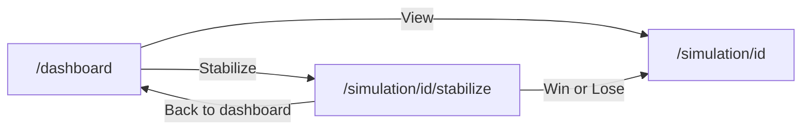

# Dashboard wireframe — Person D → Person C / implement at h15

**Route:** `/dashboard`  
**Data:** `useQuery(api.dashboard.listPublic)` (Person A)  
**Copy:** `lib/stabilizeCopy.ts` · `docs/STABILIZE_COPY.md`  
**Demo targets:** “The Convention Reversed” (chaos 88), “Magha's Eternal Reign” (chaos 91)

---

## Purpose

Global feed of **published** alternate timelines. Judges see community “broken history” and can open **Stabilize** on high-chaos cards (Beat 3).

---

## Page layout (desktop ≥ 1024px)

```
┌─────────────────────────────────────────────────────────────────────────────┐
│  [Logo] AltEra          Explore timelines    Dashboard (active)    [Sign in] │
├─────────────────────────────────────────────────────────────────────────────┤
│                                                                             │
│  Global timelines                                    [optional: sort ▼ New] │
│  Alternate histories published by the community.                            │
│                                                                             │
│  ┌──────────────────┐  ┌──────────────────┐  ┌──────────────────┐        │
│  │ [thumbnail 16:9] │  │ [thumbnail 16:9] │  │ [thumbnail 16:9] │        │
│  │                  │  │                  │  │                  │        │
│  │ [Chaos 88]       │  │ [Chaos 91]       │  │ [Chaos 42]       │        │
│  │ The Convention   │  │ Magha's Eternal  │  │ …title…          │        │
│  │ Reversed         │  │ Reign            │  │                  │        │
│  │ by Kasun         │  │ by Pathum        │  │ by …             │        │
│  │                  │  │                  │  │                  │        │
│  │ [ View ] [Stabilize]│ │ [ View ] [Stabilize]│ │ [ View ]          │        │
│  └──────────────────┘  └──────────────────┘  └──────────────────┘        │
│                                                                             │
│  (more cards in responsive grid: 3 cols → 2 → 1)                            │
└─────────────────────────────────────────────────────────────────────────────┘
```

---

## Page layout (mobile < 768px)

```
┌─────────────────────────────┐
│ ☰  AltEra            Sign in │
├─────────────────────────────┤
│ Global timelines            │
│                             │
│ ┌─────────────────────────┐ │
│ │ [thumbnail full width]  │ │
│ │ [Chaos 88]  Chaotic     │ │
│ │ The Convention Reversed │ │
│ │ by Kasun                │ │
│ │ [ View    ] [ Stabilize]│ │
│ └─────────────────────────┘ │
│ ┌─────────────────────────┐ │
│ │  …next card…            │ │
│ └─────────────────────────┘ │
└─────────────────────────────┘
```

---

## Feed card component (`PublishedTimelineCard`)

| Zone | Content | Source field |
|------|---------|--------------|
| Thumbnail | Relic or timeline cover, 16:9, `object-cover` | `thumbnailUrl` |
| Chaos badge | `Chaos {score}` + optional band color | `chaosScore` |
| Title | 2 lines max, ellipsis | `title` |
| Author | `by {firstName}` | `author` / user |
| Actions | Primary + secondary buttons | see below |

### Actions logic

| Condition | Primary | Secondary |
|-----------|---------|-----------|
| `chaosScore >= 70` (or `isChaotic`) | **View** → `/simulation/[id]` | **Stabilize** → stabilize flow |
| `chaosScore < 70` | **View** only | hide Stabilize |

Button labels: `stabilizeCopy.dashboard.view` / `stabilizeCopy.dashboard.stabilize`

### Chaos badge colors (suggested)

| Score | Badge style | Band label (optional tooltip) |
|-------|-------------|-------------------------------|
| 0–30 | green/muted | Stable |
| 31–60 | amber | Unsettled |
| 61–85 | orange | Chaotic |
| 86–100 | red | Timeline fracture |

Use `chaosBand()` from `lib/stabilizeCopy.ts`.

---

## Navigation flows



**Stabilize route options (pick one at implement):**

- A) `/simulation/[id]/stabilize` — dedicated page (recommended)
- B) Modal overlay on dashboard — faster for demo

---

## Stabilize flow wireframe (from dashboard card)

```
┌─────────────────────────────────────────────────────────────┐
│  ← Back to dashboard                                        │
│                                                             │
│  Stabilize this timeline                                    │
│  Another historian broke this timeline. Pick corrective     │
│  decisions to lower the Chaos Score below 40…               │
│                                                             │
│  Current chaos: [████████░░] 88  Chaotic                    │
│  Win when chaos < 40                                          │
│                                                             │
│  Pick one or more fixes:                                    │
│  ┌─────────────────────────────────────────────────────┐   │
│  │ ○ Reinstate exiled Kandyan nobles                     │   │
│  │   Bring moderating chiefs back into court politics…   │   │
│  └─────────────────────────────────────────────────────┘   │
│  ┌─────────────────────────────────────────────────────┐   │
│  │ ○ Demobilize rebel militias in the hills              │   │
│  └─────────────────────────────────────────────────────┘   │
│  … 3–5 choices from API …                                   │
│                                                             │
│              [ Apply fixes ]                                │
└─────────────────────────────────────────────────────────────┘
```

### After submit

| Result | UI |
|--------|-----|
| Loading | `stabilizeCopy.loading` |
| Win (`chaos < 40`) | `WinBanner` — green, badge WIN |
| Lose | lose copy + **Try other fixes** |
| Error | error copy + hint `?demo=1` |

Fixture: `convex/seed/demoStabilizeWin.json`

---

## Page states

### Loading

- Skeleton grid: 6 placeholder cards (pulse animation)
- Header visible

### Empty (no published timelines)

```
        No published timelines yet.
        Be the first to rewrite history —
        [ Explore timelines ]
```

### Error (query failed)

```
        Could not load the feed.
        [ Retry ]
```

---

## Header additions (optional h15–18)

| Element | Placement | Notes |
|---------|-------------|-------|
| `🏆 Wins: N` | Header right, signed-in | `playerStats` — Person A |
| Sign in | Header | Convex Auth |

---

## Grid spec (Tailwind suggestion for Person C)

| Breakpoint | Columns | Gap |
|------------|---------|-----|
| default | 1 | `gap-6` |
| `md` | 2 | |
| `lg` | 3 | |

Card: `rounded-xl border border-stone-800 bg-stone-900/80 overflow-hidden`

---

## Judge demo (Beat 3) — click path

1. Land on `/dashboard`
2. Point at card **Chaos 88** — “The Convention Reversed”
3. Click **Stabilize**
4. Select **2** corrective choices (demo: nobles + disarm militias)
5. **Apply fixes** → chaos **32** → WIN banner
6. Optional: **Back to dashboard**

---

## Implementation checklist (h15–18)

- [ ] `app/dashboard/page.tsx` — `useQuery(api.dashboard.listPublic)`
- [ ] `components/PublishedTimelineCard.tsx`
- [ ] `components/ChaosBadge.tsx`
- [ ] `components/StabilizeChallenge.tsx` + `components/WinBanner.tsx`
- [ ] Import strings from `@/lib/stabilizeCopy`
- [ ] Seed chaotic cards visible (Person A + D)
- [ ] Mobile: no horizontal scroll; buttons stack if needed

---

## Related docs

| Doc | Role |
|-----|------|
| `DEMO.md` | Judge script |
| `docs/STABILIZE_COPY.md` | All stabilize strings |
| `convex/seed/demoStabilizeWin.json` | Offline win path |
| `altera_greenfield_plan_2f3c16dd.plan.md` | Full product spec |
